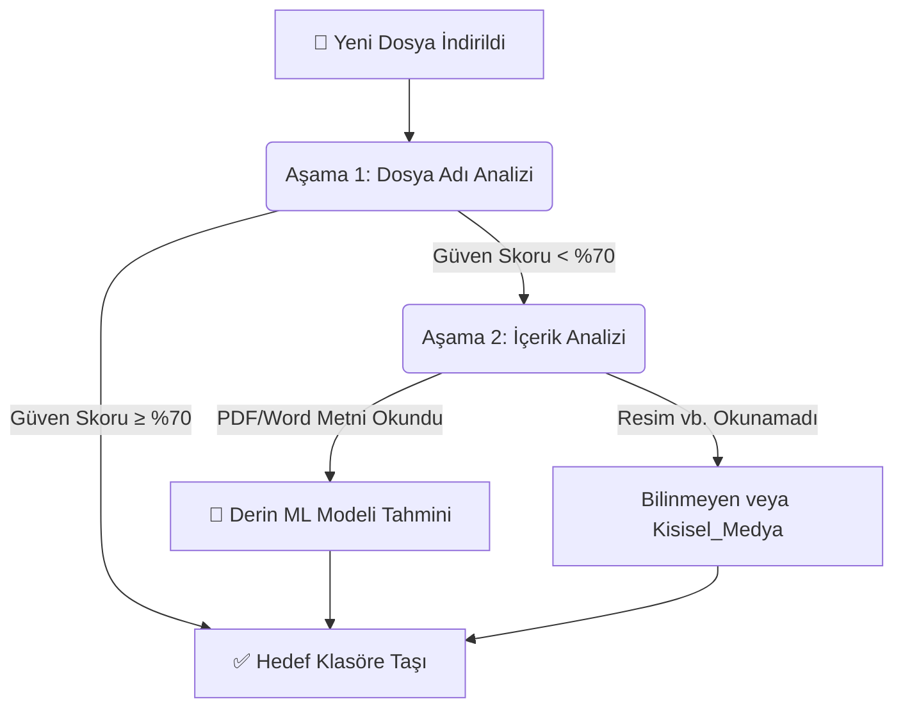

<p align="center">
  
  
  
</p>

<h1 align="center">🧠 SmartOSOrganizer</h1>

Masaüstünüz ve İndirilenler klasörünüz sürekli dağılıyor mu? **SmartOSOrganizer**, yapay zeka ve makine öğrenimi kullanarak dosyalarınızı **otomatik analiz eder** ve kendi belirlediğiniz doğru klasörlere taşır. Arka planda sessizce çalışır, bilgisayarınızı her zaman düzenli tutar.

---

## 🏗 Sistem Şeması

Yapay zekamız dosyaları anlamak için **iki aşamalı** bir karar mekanizması kullanır:



> Sistem dosya adından tam emin olamazsa dosyanın **içine girer**, metinleri (veya resimlerdeki yüzleri) analiz eder ve en doğru kararı verir.

---

## 🚀 Nasıl Yüklenir?

Kurulum oldukça basittir. Terminalde aşağıdaki adımları sırasıyla kopyalarak çalıştırın:

**1. Projeyi Klonlayın ve Klasöre Girin**
```bash
git clone https://github.com/Boran-Sert/Downloads-Organizer.git
cd Downloads-Organizer
```

**2. Sanal Ortam Oluşturun ve Aktif Edin** (Önerilen)
```powershell
python -m venv venv
.\venv\Scripts\Activate.ps1    # PowerShell kullananlar için
```

**3. Kurulumu Tamamlayın**
```bash
pip install -r requirements.txt
pip install -e .
```

Sisteminiz kullanıma hazır! 🎉 

---

## 💻 Nasıl Kullanılır?

Kurulumdan sonra komut satırınıza `organizer` komutu eklenir.

**🤖 Arka Plan Hizmetini Başlat (Otomatik Düzenleme)**
```bash
organizer start
```
*Görevi: Masaüstü ve İndirilenler klasörünü canlı olarak izler. Yeni dosya indiği anda akıllıca sınıflandırıp `~/SmartOrganizer/Kategori_Adı` içine taşır.*

**🧹 Geçmiş Dosyaları Temizle (Toplu Tarama)**
```bash
organizer scan
```
*Görevi: Şu an dağınık olan tüm klasörleri tek seferde tarar ve hepsini anında ait oldukları yerlere gönderir.*

**Diğer Komutlar:**
```bash
organizer status  # Sistemin çalışıp çalışmadığını kontrol et
organizer stop    # Sistemi güvenlice durdur
```

---

## 🎓 Yapay Zekayı Kendi Dosyalarımla Nasıl Eğitirim?

Bu proje, sınıflandırmayı sizin dosyalarınıza göre **kişiselleştirecek** şekilde tasarlandı. (Örn: `Okul`, `Fatura`, `Is`, `Oyun` vb. kategoriler tamamen size ait)

1. **Şablonları Oluşturun:** Bilgisayarınızdaki dosya isimlerini okuyarak boş Excel şablonları oluşturur:
   ```bash
   python csv.py
   ```
2. **Kategorileri Doldurun:** `data/` klasörü içinde oluşan CSV dosyalarını açın ve dosyalara kendi kategorinizi yazın (Örn: `fatura.pdf` -> `Fatura`).
3. **Modeli Eğitin:**
   ```bash
   python models/train_models.py
   ```

Tebrikler, **SmartOSOrganizer** artık sizin alışkanlıklarınızı ve dosyalarınızı tamamen öğrendi!

---
*Geliştirici: [Boran Sert](https://github.com/Boran-Sert) | MIT Lisansı ile açık kaynaklı olarak yayınlanmıştır.*
